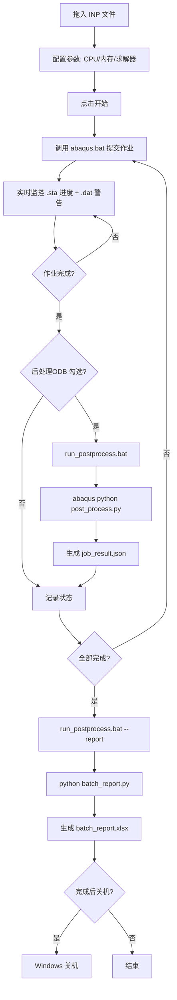

# AbaqusJob — C# + Python 混合批处理系统

## 目录结构

```
Python版/
├── Abaqus_Job/                        # C# 源码工程 (Visual Studio 2022)
│   ├── AbaqusJob.csproj               # 项目文件 (net48 WinForms)
│   ├── AbaqusJob/
│   │   ├── Form1.cs                   # 主界面 (4250行)
│   │   ├── JobItem.cs                 # 作业数据模型
│   │   ├── SettingsForm.cs            # 设置面板
│   │   ├── ScheduleSetupForm.cs       # 定时调度弹窗
│   │   ├── AutoShutdownDialog.cs      # 自动关机倒计时
│   │   └── My/                        # VB.NET 兼容层 + 设置持久化
│   └── app.ico                        # 应用程序图标
│
├── python/                            # Python 脚本模块
│   ├── abaqus_utils.py                # 共享工具库 (ODB提取/STA解析/路径检测)
│   ├── post_process.py                # 命令行 ODB 后处理引擎
│   ├── batch_report.py                # 批量汇总报告 (Excel/HTML)
│   ├── config.py                      # 统一配置管理
│   ├── autoresult.py                  # [原有] ODB结果提取 (GUI选文件→CSV)
│   ├── autoload.py                    # [原有] 批量模型创建+载荷配置 (CSV驱动)
│   ├── CreateJob.py                   # [原有] 作业创建/INP导出/提交/等待
│   ├── my_plugin.py                   # [原有] Abaqus/CAE 插件注册
│   ├── run_postprocess.bat            # C# ↔ Python 桥接入口
│   └── abaqus_job_config.json         # 全局 JSON 配置
│
├── result_config.csv                  # 结果提取配置 (根目录)
├── load_cases.csv                     # 载荷工况定义 (根目录)
│
├── AbaqusJob说明书V10.docx            # 原版说明书
└── 使用说明.md                         # 本文件
```

---

## 一、快速开始

### 1. 编译 C# GUI

```bash
# 需要 Visual Studio 2022 或 MSBuild
cd Abaqus_Job
dotnet build AbaqusJob.csproj -c Release
# 输出: bin\Release\net48\AbaqusJob.exe
```

> [!note] ✏️ 依赖
> **.NET Framework 4.8**（Windows 10/11 自带），无需额外安装。

### 2. 配置 Python 环境

编辑 [[python/abaqus_job_config.json]]：

```json
{
  "abaqus_path": "C:\\SIMULIA\\Commands\\abaqus.bat",
  "cpu_count": 20,
  "memory_limit": 80,
  "post_process_odb": true,
  "generate_report": true,
  "export_images": false
}
```

| 字段                 | 说明               | 默认值       |
| -------------------- | ------------------ | ------------ |
| `abaqus_path`      | abaqus.bat 路径    | 自动检测     |
| `cpu_count`        | 默认 CPU 核数      | ==20==   |
| `memory_limit`     | 内存百分比         | ==80==   |
| `post_process_odb` | 完成后是否提取 ODB | ==true== |
| `generate_report`  | 是否生成汇总报告   | ==true== |
| `export_images`    | 是否导出云图截图   | false        |

### 3. 配置结果提取

编辑 [[result_config.csv]]，指定要从 ODB 中提取哪些结果：

```csv
instance_name,step_name,set_name,result_type
PART-1-1,Step-2,ZYG,S:Mises
PART-1-1,Step-2,ZYG,PEEQ
PART-1-1,Step-2,GZG,S:Mises
PART-1-1,Step-2,HSG,U:Mag
```

| 列                | 说明                                                                                                 |
| ----------------- | ---------------------------------------------------------------------------------------------------- |
| `instance_name` | ODB 中的实例名                                                                                       |
| `step_name`     | 分析步名称                                                                                           |
| `set_name`      | 单元/节点集合名（逗号分隔，或`ALL` 取全部）                                                        |
| `result_type`   | ==`S:Mises`== / ==`PEEQ`== / ==`U:Mag`== / ==`E:Eqv`== / ==`SDV1`== 等 |

> [!tip] 💡 `ALL` 关键字
> `set_name` 设为 `ALL` 时会自动展开为 ODB 中该实例的全部单元集合并逐个提取。

---

## 二、使用方式

### 方式 A：C# GUI（推荐日常使用）

1. 双击 `Abaqus_Job\bin\Release\net48\AbaqusJob.exe`
2. 拖入 `.inp` 文件（支持批量）
3. 可选：拖入 `.for`/`.f` 子程序文件到对应行
4. 点击 ==▶ 开始== 提交作业
5. 程序自动监控 `.sta`/`.dat`，实时显示进度和警告
6. ==作业完成后自动触发 Python 后处理==（设置面板可开关）
7. ==全部完成后自动生成汇总报告==

> [!info] 后处理开关
> 菜单 → 设置 → 其他设置 → ☑ **后处理(ODB)**
n	#### 工作目录设置

	菜单 → **文件(&F) → 设置工作目录(&W)...**（快捷键 `Ctrl+W`），选择目录后所有 Abaqus 输出文件（`.sta`/`.dat`/`.odb`/`.msg`）统一写入该目录。表格中的 ==输出路径== 和 ==ODB 文件== 列会自动更新。

	#### 合并 ODB（restartjoin）

	1. 按住 `Ctrl` 或 `Shift` 选中两个已完成的任务行
	2. 右键 → **合并ODB**
	3. 自动执行 `abaqus restartjoin` 合并两个 ODB，实时输出日志

	#### 多选操作

	表格支持 `Ctrl+点击` 逐个多选、`Shift+点击` 范围选择任务行。

### 方式 B：纯 Python 命令行

适用于在 Linux/HPC 集群上运行，或脚本化集成。

#### 单作业 ODB 提取

```bash
abaqus python post_process.py \
  --odb job.odb \
  --config result_config.csv \
  --output ./results/
```

输出 `job_result.json`：

```json
{
  "job_name": "HA5EA-1-L1",
  "odb_path": "./HA5EA-1-L1.odb",
  "status": "completed",
  "sta_summary": "  [Step-2] 12 increments, 35 attempts, 0 severe discon\n  ✅ COMPLETED SUCCESSFULLY",
  "warnings_summary": "共 3 条警告: CONTACT=2, MATERIAL=1",
  "results": [
    {"step": "Step-2", "set": "ZYG", "type": "S:Mises", "value": 235.6},
    {"step": "Step-2", "set": "ZYG", "type": "PEEQ", "value": 0.015}
  ]
}
```

#### 批量汇总报告

```bash
python batch_report.py \
  --results-dir ./results/ \
  --format excel
```

生成 `batch_report.xlsx`，含：

- 统计摘要（总数/完成/失败）
- 逐作业结果值矩阵
- 条件格式：🟢 绿色 = 正常，🟡 黄色 = 有警告，🔴 红色 = 失败

#### 工具函数独立使用

```python
from abaqus_utils import (
    find_abaqus_bat,        # 自动搜索 abaqus.bat
    parse_sta_file,          # 结构化解析 .sta 文件
    parse_dat_warnings,      # 分类统计 .dat 警告
    extract_field_max,       # 提取 ODB 场输出最大值
    extract_history,         # 提取 ODB 历史输出
    check_job_complete,      # 检测作业是否完成
)
```

### 方式 C：Abaqus/CAE 插件

**安装**：将以下 4 个文件复制到 `C:\Users\IES15c172\abaqus_plugins\`：

| 文件 | 说明 |
|------|------|
| [[python/my_plugin.py]] | 插件注册入口 |
| [[python/CreateJob.py]] | 作业创建/提交 |
| [[python/autoload.py]] | 模型 + 载荷配置 |
| [[python/autoresult.py]] | ODB 结果提取 |

```bash
cp python/my_plugin.py python/CreateJob.py python/autoload.py python/autoresult.py \
   "C:\Users\IES15c172\abaqus_plugins\"
```

启动 Abaqus/CAE 后，菜单 ==Plugins== 中出现 6 个按钮：

| 按钮       | 功能                                   |
| ---------- | -------------------------------------- |
| CreateJob  | 为所有 Model 创建 Job 定义             |
| CreateInp  | 创建 Job 并导出 INP 文件               |
| CreateRun  | 创建 Job → 提交 → 等待完成           |
| RunJob     | 提交所有已有 Job 并等待                |
| autoload   | 从 CSV 批量创建模型 + 施加载荷         |
| autoresult | 选择 ODB + CSV → 提取结果 → 输出 CSV |

---

## 三、工作流程图



---

## 四、常见问题

> [!faq] - Q: Python 脚本报 "odbAccess 不可用"
> 必须通过 Abaqus 内置 Python 运行，不能用系统 Python：
>
> ```bash
> # ❌ 错误
> python post_process.py --odb job.odb
>
> # ✅ 正确
> abaqus python post_process.py --odb job.odb
> ```

> [!faq] - Q: C# GUI 找不到 run_postprocess.bat
> 确保 `run_postprocess.bat` 在 `Python版/python/` 目录中。C# 从 EXE 向上 4 层 → `Python版/`，再进入 `python/` 查找。如果仍报错，检查 `python/abaqus_job_config.json` 中的 `abaqus_path` 是否正确。

> [!faq] - Q: 如何关闭后处理
> 设置面板 → 其他设置 → 取消勾选 ==后处理(ODB)==。关闭后仅监控作业，不提取 ODB。

> [!faq] - Q: Excel 报告报 "openpyxl 未安装"
> ```bash
> pip install openpyxl
> ```

> [!faq] - Q: 如何在 Linux/HPC 上使用
> 用纯 Python 命令行方式（方式 B）。[[python/abaqus_utils.py]]、[[python/post_process.py]]、[[python/batch_report.py]] 均跨平台兼容。C# GUI 仅 Windows。

---

## 五、文件对照表

| 你需要...                   | 用这个                                       |
| --------------------------- | -------------------------------------------- |
| 图形界面批处理 Abaqus 作业  | `Abaqus_Job\AbaqusJob.exe` (编译后)        |
| 作业完成后自动提取 ODB 结果 | C# GUI 自动调用[[python/post_process.py]]                              |
| 批量 ODB→CSV (手动选文件)  | [[python/autoresult.py]] (GUI)                                       |
| 命令行 ODB→JSON            | `abaqus python post_process.py --odb ...`  |
| 批量结果→Excel 报告        | `python batch_report.py --results-dir ...` |
| 从 CSV 创建模型+载荷        | [[python/autoload.py]] (CAE 插件)                                  |
| CAE 内一键创建/提交作业     | [[python/my_plugin.py]] (CAE 菜单)                                  |
| 自动找到 abaqus.bat         | `abaqus_utils.find_abaqus_bat()`           |
| 解析 .sta 文件              | `abaqus_utils.parse_sta_file()`            |
| 分类 .dat 警告              | `abaqus_utils.parse_dat_warnings()`        |
| 修改默认配置                | 编辑[[python/abaqus_job_config.json]]                                         |
| 修改要提取的结果字段        | 编辑[[result_config.csv]]                                         |

%% 2026-08-10 创建，随项目持续更新 %%
